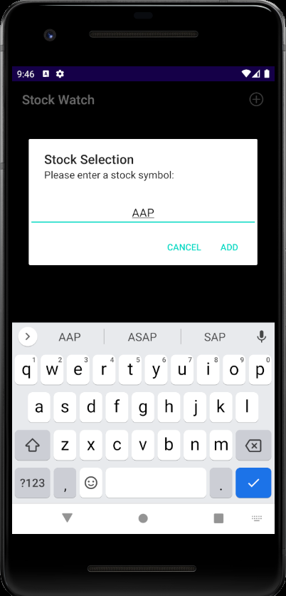
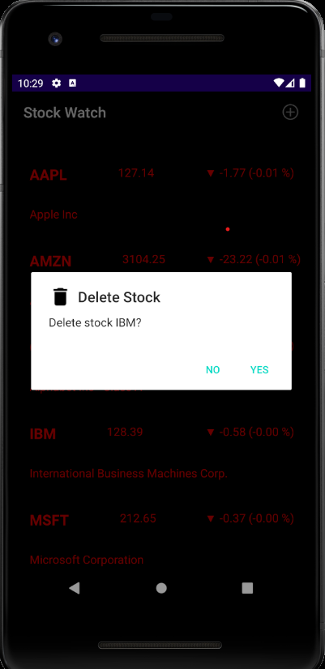
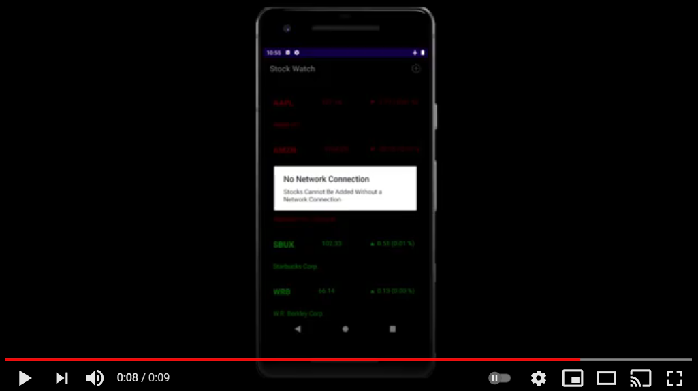

<!-- Project Shields -->

[![LinkedIn][linkedin-shield]][linkedin-url]
[![Handshake][handshake-shield]][handshake-url]

<!-- Logo with links  -->
 

  <h3 align="center">Welcome, Potential Employers</h3>

  

    Listed below are my most notable projects built in Android Studio
     
    <a href="https://github.com/rich-watson/rich-watson.github.io/tree/master/Mobile%20Development%20for%20Android"><strong>Explore the Java documentation »</strong></a>
     
     
    <a href="https://www.linkedin.com/in/richard-watson-9b65671a4/">LinkedIn Profile</a>
    ·
    <a href="https://app.joinhandshake.com/users/15592375">HandShake Profile</a>

  
  

 

<!-- Table of Contents -->

  
Table of Contents

  <ol>
    <li>
      <a href="#distance-converter">Distance Converter</a>
    </li>
    <li>
      <a href="#notes-application">Notes Application</a>
    </li>
    <li>
      <a href="#stock-watcher-with-iex-trading-api">Stock Watcher</a>
    </li>
    <li>
      <a href="#know-your-government-with-google-civic-api">Know Your Government</a>
    </li>
  </ol>

 
 

<!-- Distance Converter -->

  
<h2>Distance Converter</h2>

#### Converts Miles to Kilometers and vice versa

 

#### Landscape view with no data loss

 
 
 
 
 

<!-- Notes App -->

  
<h2>Notes Application</h2>

#### Edit Activity with custom save icon and multi-line EditText

 
 
 

#### Notes save in order of last saved with preview snippets displaying first 80 characters

 
 
 

#### Back button prompts user with alert dialog to save

 
 
 

#### Action Bar keeps track of how many notes are saved

 
 
 

#### Notes are saved to JSON for permanent access

#### About activity with version number and copyright

 
 
 
 
 

<!-- Stock Watcher Application  -->

  
<h2>Stock Watcher with IEX Trading API</h2>

#### Main Activity with CAPS-only search and search results

 
 
 

#### Custom stock list displayed in recycler view with positive/negative color change

   
   
   

#### Long press displays delete alert dialog

   
   
   

#### Stocks are saved to JSON and updated with pulldown refresh

 
 
 

#### No Network Connection alert dialog on add attempt in airplane mode

 
 
 

#### Duplicate Stock alert dialog

 
 
 

#### Stock Not Found alert dialog

 
 
 

#### Swipe Refresh with no network attempt

 
 
 

#### onClick() brings user to MarketWatch.com for more information on respective stock

 
 
 
 
 

<!-- Know Your Government Application -->

  
<h2>Know your Government Application with Google Civic API</h2>

#### Application awaits location permissions on first bootup

 
 
 

#### All government officials from President to locals are displayed in recycler view

 
 
 

#### User can manually change location to see other officials

 
 
 

#### onClick() produces ScrollView with contact and social media information built with implied intents and linkify

 
 
 

#### Clickable links to social media pages and respective contact Information

 
 
 

#### Location links work where applicable with Google Maps

 
 
 

#### A placeholder image is loaded when no image is available

 
 
 

#### Custom landscape view for Official activity

 
 
 

#### Clicking on an official's picture directs to Photo Activity with larger photo

 
 
 

#### Photo Activity in landscape mode

 
 
 

#### Alert Dialog displays when no network is detected

 
 
 

#### Custom images for when no network is detected

 
 
 

#### Custom Launcher Icon

 
 
 

#### About Activity with copyright and version

 
 
 

<!-- Markdown Links and Shields -->

[linkedin-shield]: https://img.shields.io/badge/-LinkedIn-black.svg?style=for-the-badge&logo=linkedin&colorB=555
[linkedin-url]: https://www.linkedin.com/in/richard-watson-9b65671a4/
[handshake-shield]: https://img.shields.io/badge/-Handshake-blue?style=for-the-badge
[handshake-url]: https://app.joinhandshake.com/users/15592375
